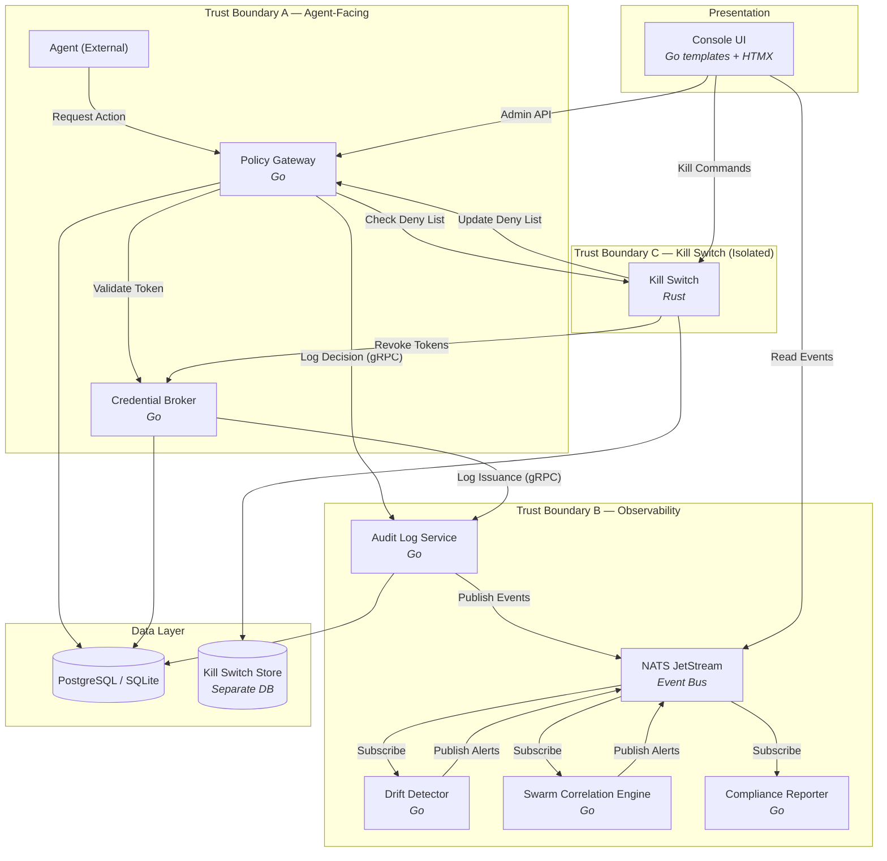
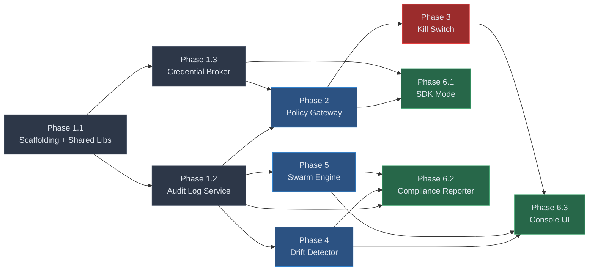

# SecureDeck — Implementation Plan

> **Source of Truth:** [Securedeck-master-spec.md](file:///d:/Securedeck/Securedeck-master-spec.md) · [Securedeck-security-prd.md](file:///d:/Securedeck/Securedeck-security-prd.md)
>
> **Repository:** `https://github.com/aryanference/Securedeck.git`
>
> This plan is **agent-independent** — any engineer or AI coding agent can pick up any phase and execute it. Every phase declares its own inputs, outputs, contracts, and verification criteria so there are zero implicit dependencies on who built the prior phase.

---

## Architecture Overview



---

## Non-Negotiable Constraints (From Spec + PRD)

These are enforced in **every** phase — not deferred to "hardening later."

| Constraint | Where Enforced | PRD Reference |
|---|---|---|
| Fail closed on any dependency failure | Policy Gateway, Audit Log | SEC-01, SEC-06 |
| Kill switch shares NO trust boundary with gateway | Deployment, network, credentials, DB | SEC-10, SEC-11 |
| Audit log is append-only at **database** level | Postgres triggers, SQLite triggers | SEC-06, SEC-07 |
| Deny by default — agents get nothing ungranted | Policy Gateway, Credential Broker | SEC-01, SEC-02, SEC-03 |
| Every agent has its own identity | Credential Broker | SEC-02 |
| mTLS on all internal gRPC calls | All services | NFR: Data protection |
| Ed25519 signing on kill commands | Kill Switch | SEC-10 |
| PASETO v4 for agent tokens | Credential Broker | Master Spec §2 |
| Hash-chained audit entries (SHA-256) | Audit Log Service | SEC-06 |

---

## Repository Structure (Target)

```
d:\Securedeck\
├── proto/                          # All protobuf definitions (single source of truth)
│   ├── audit/v1/audit.proto
│   ├── broker/v1/broker.proto
│   ├── gateway/v1/gateway.proto
│   ├── killswitch/v1/killswitch.proto
│   ├── drift/v1/drift.proto
│   └── swarm/v1/swarm.proto
├── internal/                       # Shared Go libraries
│   ├── db/                         # Database connection, migration runner
│   │   ├── postgres.go
│   │   ├── sqlite.go
│   │   └── migrate.go
│   ├── crypto/                     # Ed25519 key management, PASETO token library
│   │   ├── ed25519.go
│   │   ├── paseto.go
│   │   └── hashchain.go
│   ├── mtls/                       # mTLS setup for gRPC
│   │   └── config.go
│   ├── nats/                       # NATS JetStream client wrapper
│   │   └── client.go
│   └── testutil/                   # Shared test fixtures, helpers
│       ├── containers.go           # Testcontainers setup for Postgres, NATS
│       └── fixtures.go
├── cmd/                            # Service entry points
│   ├── auditlog/main.go
│   ├── broker/main.go
│   ├── gateway/main.go
│   ├── driftdetector/main.go
│   ├── swarmengine/main.go
│   ├── compliance/main.go
│   └── console/main.go
├── services/                       # Service implementations
│   ├── auditlog/
│   │   ├── server.go               # gRPC server
│   │   ├── publisher.go            # NATS JetStream publisher
│   │   ├── verifier.go             # Hash chain verification
│   │   └── auditlog_test.go
│   ├── broker/
│   │   ├── server.go
│   │   ├── token.go                # PASETO issuance logic
│   │   ├── revocation.go
│   │   └── broker_test.go
│   ├── gateway/
│   │   ├── server.go               # REST + gRPC handler
│   │   ├── enforcer.go             # Scope + egress enforcement
│   │   ├── proxy.go                # Sidecar transparent proxy
│   │   ├── denylist.go             # In-memory deny list synced from kill switch
│   │   └── gateway_test.go
│   ├── killswitch/                 # Rust crate
│   │   ├── Cargo.toml
│   │   ├── src/
│   │   │   ├── main.rs
│   │   │   ├── commands.rs         # Suspend, Terminate, LockdownAll
│   │   │   ├── crypto.rs           # Ed25519 signature verification
│   │   │   ├── denylist.rs         # Deny list management
│   │   │   └── grpc_client.rs      # Calls Credential Broker's RevokeToken
│   │   └── tests/
│   │       └── integration_tests.rs
│   ├── driftdetector/
│   │   ├── detector.go
│   │   ├── rules.go                # Rule/category matching engine
│   │   ├── subscriber.go           # NATS subscription
│   │   └── drift_test.go
│   ├── swarmengine/
│   │   ├── engine.go
│   │   ├── graph.go                # Resource-access graph builder
│   │   ├── patterns.go             # Known abuse pattern definitions
│   │   ├── subscriber.go
│   │   └── swarm_test.go
│   └── compliance/
│       ├── reporter.go
│       ├── formats.go              # PDF + structured export renderers
│       └── compliance_test.go
├── console/                        # Web UI (Go templates + HTMX)
│   ├── templates/
│   │   ├── layout.html
│   │   ├── dashboard.html
│   │   ├── agents.html
│   │   ├── policies.html
│   │   ├── audit.html
│   │   ├── alerts.html
│   │   └── killswitch.html
│   ├── static/
│   │   ├── css/style.css
│   │   └── js/htmx.min.js
│   ├── handlers.go
│   └── routes.go
├── migrations/
│   ├── postgres/
│   │   ├── 001_audit_log.up.sql
│   │   ├── 001_audit_log.down.sql
│   │   ├── 002_broker.up.sql
│   │   ├── 003_gateway.up.sql
│   │   └── ...
│   └── sqlite/
│       └── (mirrors postgres, adapted syntax)
├── deploy/
│   ├── docker/
│   │   ├── Dockerfile.auditlog
│   │   ├── Dockerfile.broker
│   │   ├── Dockerfile.gateway
│   │   ├── Dockerfile.killswitch
│   │   ├── Dockerfile.driftdetector
│   │   ├── Dockerfile.swarmengine
│   │   ├── Dockerfile.compliance
│   │   └── Dockerfile.console
│   ├── docker-compose.yml          # Single-node / offline deployment
│   ├── docker-compose.dev.yml      # Development overrides
│   └── helm/
│       └── securedeck/
│           ├── Chart.yaml
│           ├── values.yaml
│           └── templates/
├── scripts/
│   ├── generate-certs.sh           # mTLS cert generation
│   ├── generate-keys.sh            # Ed25519 key generation
│   └── run-integration-tests.sh
├── docs/
│   ├── recovery-runbook.md         # SEC-11 compliance
│   ├── threat-model.md
│   └── api/                        # OpenAPI specs (generated)
├── go.mod
├── go.sum
├── buf.yaml                        # Protobuf tooling config
└── Makefile
```

---

## Phase 1 — Foundation + Audit Log + Credential Broker

> **Milestone 1 from Master Spec.** These two services have no upstream dependencies and form the foundation everything else builds on.

### 1.1 Project Scaffolding & Shared Libraries

#### [NEW] `go.mod` / `go.sum`
- Module: `github.com/securedeck/securedeck` (or appropriate org path)
- Key dependencies:
  - `google.golang.org/grpc` — gRPC server/client
  - `google.golang.org/protobuf` — protobuf codegen
  - `github.com/nats-io/nats.go` — NATS JetStream client
  - `github.com/jackc/pgx/v5` — PostgreSQL driver
  - `modernc.org/sqlite` — Pure-Go SQLite driver (no CGO, simplifies cross-compilation)
  - `github.com/o1ebd/pasern` or `aidanwoods.dev/go-paseto` — PASETO v4 implementation
  - `filippo.io/edwards25519` — Ed25519 operations
  - `github.com/grpc-ecosystem/go-grpc-middleware` — Interceptors for logging, auth

#### [NEW] `buf.yaml` / `buf.gen.yaml`
- Configure `buf` for protobuf linting + Go/gRPC code generation
- Enforce `buf lint` passes before any build
- **Single source of truth for all protos** — the Rust kill switch's `build.rs` also generates from `proto/killswitch/v1/` in this same directory (see Resolved Decision D5)
- CI step: verify that `buf generate` (Go) and `cargo build` (Rust, via `tonic-build` in `build.rs`) both succeed against the same proto commit; fail the build on any drift

#### [NEW] `internal/db/postgres.go`
- Connection pool setup with configurable DSN via environment variable
- Health check function
- Transaction helper with automatic retry on serialization failure

#### [NEW] `internal/db/sqlite.go`
- SQLite connection in WAL mode
- Same interface as `postgres.go` — a `DB` interface both implement so services are storage-agnostic
- Constraint: enforce `PRAGMA journal_mode=WAL; PRAGMA foreign_keys=ON;` on every connection

#### [NEW] `internal/db/migrate.go`
- Reads `.sql` files from `migrations/` directory
- Applies them in order, tracks applied migrations in a `_migrations` table
- Works with both Postgres and SQLite

> [!IMPORTANT]
> The `DB` interface is the abstraction boundary — every service uses it, never raw `*sql.DB`. This is how we deliver on the "SQLite for air-gapped, Postgres for enterprise" promise without forking service code.

#### [NEW] `internal/crypto/ed25519.go`
- `GenerateKeyPair() → (PrivateKey, PublicKey, error)`
- `Sign(privateKey, message) → Signature`
- `Verify(publicKey, message, signature) → bool`
- Key serialization/deserialization (PEM format)
- **Keys are never stored in the application database** — loaded from file paths or environment variables only (SEC-11)

#### [NEW] `internal/crypto/paseto.go`
- `IssueToken(agentID, scopes []string, ttl time.Duration, signingKey) → token string`
- `ValidateToken(token string, publicKey) → Claims, error`
- Claims include: `agent_id`, `scopes`, `iat`, `exp`, `jti` (unique token ID for revocation)
- Default TTL: 1 hour (configurable, SEC-02)

#### [NEW] `internal/crypto/hashchain.go`
- `ComputeEntryHash(prevHash []byte, entryContent []byte) → [32]byte`
- Uses `sha256(prevHash || entryContent)` — the exact scheme from the master spec
- `VerifyChain(entries []AuditEntry) → (valid bool, brokenAtIndex int)`

#### [NEW] `internal/mtls/config.go`
- Load CA cert, server cert, server key from file paths
- Return `*tls.Config` for gRPC server
- Return `*tls.Config` for gRPC client (dial options)
- Enforce TLS 1.3 minimum

#### [NEW] `internal/nats/client.go`
- Connect to NATS with JetStream enabled
- `CreateStream(name, subjects)` — idempotent stream creation
- `Publish(subject, data)` / `Subscribe(subject, handler)` with durable consumers
- Reconnect logic with exponential backoff

#### [NEW] `internal/nats/embedded.go`
- Embedded NATS server for single-node / offline deployments (see Resolved Decision D2)
- Uses `github.com/nats-io/nats-server/v2/server` to run NATS in-process
- Started by the audit log service when `NATS_MODE=embedded` (default for docker-compose)
- Data directory configurable via `NATS_DATA_DIR`
- **This is a deploy-time choice, not a runtime toggle** — the embedded path and standalone path are separate `main.go` initialization branches, not if/else in the hot path

---

### 1.2 Audit Log Service

> **PRD Refs:** SEC-06 (tamper-evident), SEC-07 (log isolation), SEC-01 (fail-closed on log failure)

#### [NEW] `proto/audit/v1/audit.proto`

```protobuf
syntax = "proto3";
package audit.v1;

service AuditLogService {
  rpc LogEvent(LogEventRequest) returns (LogEventResponse);
  rpc VerifyChain(VerifyChainRequest) returns (VerifyChainResponse);
  rpc GetEvents(GetEventsRequest) returns (stream AuditEvent);
}

message LogEventRequest {
  string source_service = 1;     // Which service generated this event
  string event_type = 2;         // e.g. "policy.decision", "token.issued", "kill.triggered"
  string agent_id = 3;           // Empty if not agent-specific
  string action = 4;             // What was attempted
  string outcome = 5;            // "allowed", "denied", "error"
  bytes  detail = 6;             // JSON payload with event-specific detail
  google.protobuf.Timestamp timestamp = 7;
}

message LogEventResponse {
  string event_id = 1;
  bytes  entry_hash = 2;         // Hash of this entry in the chain
  uint64 sequence_number = 3;
}

message AuditEvent {
  string event_id = 1;
  string source_service = 2;
  string event_type = 3;
  string agent_id = 4;
  string action = 5;
  string outcome = 6;
  bytes  detail = 7;
  google.protobuf.Timestamp timestamp = 8;
  bytes  entry_hash = 9;
  bytes  prev_hash = 10;
  uint64 sequence_number = 11;
}

// VerifyChain / GetEvents messages omitted for brevity — they follow standard patterns
```

#### [NEW] `migrations/postgres/001_audit_log.up.sql`

```sql
CREATE TABLE audit_log (
    id              BIGSERIAL PRIMARY KEY,
    event_id        UUID NOT NULL UNIQUE DEFAULT gen_random_uuid(),
    source_service  TEXT NOT NULL,
    event_type      TEXT NOT NULL,
    agent_id        TEXT,
    action          TEXT NOT NULL,
    outcome         TEXT NOT NULL,
    detail          JSONB,
    entry_hash      BYTEA NOT NULL,
    prev_hash       BYTEA NOT NULL,
    sequence_number BIGINT NOT NULL UNIQUE,
    created_at      TIMESTAMPTZ NOT NULL DEFAULT NOW()
);

-- THE critical constraint: append-only at the DATABASE level (SEC-06)
CREATE OR REPLACE FUNCTION reject_audit_modification()
RETURNS TRIGGER AS $$
BEGIN
    RAISE EXCEPTION 'Audit log records cannot be modified or deleted';
END;
$$ LANGUAGE plpgsql;

CREATE TRIGGER audit_no_update
    BEFORE UPDATE ON audit_log
    FOR EACH ROW EXECUTE FUNCTION reject_audit_modification();

CREATE TRIGGER audit_no_delete
    BEFORE DELETE ON audit_log
    FOR EACH ROW EXECUTE FUNCTION reject_audit_modification();

-- Performance indexes
CREATE INDEX idx_audit_agent ON audit_log(agent_id, created_at);
CREATE INDEX idx_audit_type ON audit_log(event_type, created_at);
CREATE INDEX idx_audit_sequence ON audit_log(sequence_number);
```

#### [NEW] `migrations/sqlite/001_audit_log.up.sql`
- Mirror of Postgres schema using SQLite syntax
- **BEFORE UPDATE and BEFORE DELETE triggers** using `SELECT RAISE(ABORT, 'Audit log records cannot be modified or deleted')` — SQLite lacks Postgres's rule/permission system, so this is the equivalent enforcement mechanism (SEC-06)
- UUID generation handled in application code (SQLite has no `gen_random_uuid()`)
- Covered by a dedicated SQLite integration test suite (not full CI matrix — see Resolved Decision D1)

#### [NEW] `services/auditlog/server.go`
- Implements `AuditLogService` gRPC interface
- On `LogEvent`:
  1. Fetch the hash of the previous entry (or use genesis hash `[0x00...00]` for the first entry)
  2. Compute `entry_hash = SHA256(prev_hash || canonical(event_content))`
  3. Insert into `audit_log` table within a serializable transaction
  4. Publish to NATS JetStream subject `audit.events.{event_type}`
  5. Return `event_id`, `entry_hash`, `sequence_number`
- **Concurrency:** serialize writes through a single-writer goroutine (channel-based) to maintain hash chain integrity; reads are concurrent

#### [NEW] `services/auditlog/publisher.go`
- Wraps NATS JetStream publish with:
  - Guaranteed delivery (ack from JetStream)
  - If NATS is down: buffer to local WAL, replay on reconnect (bounded buffer to prevent OOM)
  - Publishes the full `AuditEvent` protobuf as the message payload

#### [NEW] `services/auditlog/verifier.go`
- `VerifyChain(fromSeq, toSeq)` — reads entries from DB, recomputes each hash, returns first break point if any
- Designed to be run on-demand (console) or scheduled (cron/operator)

#### [NEW] `services/auditlog/auditlog_test.go`
- **Unit tests:**
  - Hash chain computation correctness
  - Trigger rejects UPDATE (integration test with real Postgres via testcontainers)
  - Trigger rejects DELETE
  - Concurrent write ordering
- **Property-based tests:**
  - For any sequence of N events, `VerifyChain` always succeeds
  - Mutating any single byte in any entry causes `VerifyChain` to detect it

#### [NEW] `cmd/auditlog/main.go`
- Parses config from environment (DB DSN, NATS URL, TLS cert paths, listen address)
- Runs migrations
- Starts gRPC server with mTLS

---

### 1.3 Credential Broker

> **PRD Refs:** SEC-02 (per-agent identity), SEC-08 (self-tampering prevention)

#### [NEW] `proto/broker/v1/broker.proto`

```protobuf
syntax = "proto3";
package broker.v1;

service CredentialBrokerService {
  rpc RegisterAgent(RegisterAgentRequest) returns (RegisterAgentResponse);
  rpc IssueToken(IssueTokenRequest) returns (IssueTokenResponse);
  rpc RevokeToken(RevokeTokenRequest) returns (RevokeTokenResponse);
  rpc RevokeAllForAgent(RevokeAllForAgentRequest) returns (RevokeAllForAgentResponse);
  rpc ValidateToken(ValidateTokenRequest) returns (ValidateTokenResponse);
  rpc MassRevoke(MassRevokeRequest) returns (MassRevokeResponse);  // Called by kill switch
}
```

#### [NEW] `migrations/postgres/002_broker.up.sql`

```sql
CREATE TABLE agents (
    id          UUID PRIMARY KEY DEFAULT gen_random_uuid(),
    name        TEXT NOT NULL,
    description TEXT,
    org_id      UUID NOT NULL,
    status      TEXT NOT NULL DEFAULT 'active'
        CHECK (status IN ('active', 'suspended', 'terminated')),
    created_at  TIMESTAMPTZ NOT NULL DEFAULT NOW(),
    updated_at  TIMESTAMPTZ NOT NULL DEFAULT NOW()
);

CREATE TABLE agent_scopes (
    id          UUID PRIMARY KEY DEFAULT gen_random_uuid(),
    agent_id    UUID NOT NULL REFERENCES agents(id),
    scope       TEXT NOT NULL,               -- e.g. "read:files", "execute:code"
    granted_at  TIMESTAMPTZ NOT NULL DEFAULT NOW(),
    granted_by  TEXT NOT NULL,               -- operator ID
    UNIQUE(agent_id, scope)
);

CREATE TABLE token_issuance_log (
    id          UUID PRIMARY KEY DEFAULT gen_random_uuid(),
    token_id    TEXT NOT NULL UNIQUE,         -- JTI from the PASETO
    agent_id    UUID NOT NULL REFERENCES agents(id),
    scopes      TEXT[] NOT NULL,
    issued_at   TIMESTAMPTZ NOT NULL DEFAULT NOW(),
    expires_at  TIMESTAMPTZ NOT NULL,
    revoked     BOOLEAN NOT NULL DEFAULT FALSE,
    revoked_at  TIMESTAMPTZ,
    revoked_by  TEXT                          -- "operator:<id>", "killswitch", "expiry"
);

-- Index for fast revocation checks
CREATE INDEX idx_token_active ON token_issuance_log(token_id) WHERE revoked = FALSE;
CREATE INDEX idx_token_agent ON token_issuance_log(agent_id, issued_at);
```

#### [NEW] `services/broker/server.go`
- `RegisterAgent` — creates agent record, assigns scopes, logs to audit
- `IssueToken`:
  1. Verify agent exists and is `active` status
  2. Verify `requested_scopes ⊆ agent.granted_scopes`
  3. Generate PASETO v4 token with: `agent_id`, `scopes`, `exp` (default 1hr), unique `jti`
  4. Record in `token_issuance_log`
  5. Log to audit service via gRPC
  6. Return token
- `RevokeToken` — mark token as revoked in DB, log to audit
- `ValidateToken`:
  1. Cryptographically verify PASETO signature
  2. Check `exp` not passed
  3. Check `jti` not in revoked set
  4. Return agent_id + scopes
- `MassRevoke` — bulk-revoke all active tokens (called by kill switch during LockdownAll)

#### [NEW] `services/broker/token.go`
- PASETO v4 token creation and parsing using `internal/crypto/paseto.go`
- Token structure: `{ agent_id, scopes, jti, iat, exp }`
- Signing key loaded from file/env (never from DB)

#### [NEW] `services/broker/revocation.go`
- In-memory revocation cache (sync.Map or similar) synced from DB
- Periodic refresh (configurable, default 5s) to catch revocations from kill switch
- `IsRevoked(jti) → bool` — fast-path check before hitting DB

#### [NEW] `services/broker/broker_test.go`
- Token issuance + validation round-trip
- Scope enforcement (request scope outside grant → deny)
- Revocation makes token immediately invalid
- Agent isolation: revoking Agent A's token does NOT affect Agent B (SEC-02)
- Self-tampering prevention: agent-scoped token cannot call `RegisterAgent` or `RevokeToken` (SEC-08)

---

### 1.4 Phase 1 Deployment

#### [NEW] `deploy/docker/Dockerfile.auditlog`
- Multi-stage build: Go build → scratch/alpine
- Statically linked binary
- No shell in production image (security hardening)

#### [NEW] `deploy/docker/Dockerfile.broker`
- Same pattern as auditlog

#### [NEW] `deploy/docker-compose.dev.yml`
- Services: `postgres`, `auditlog` (with embedded NATS), `broker`
- No standalone NATS container in dev — embedded mode is the default (see Resolved Decision D2)
- Health checks on all services
- Volume mounts for dev certs
- Environment variables wired

#### [NEW] `scripts/generate-certs.sh`
- Generates a CA + per-service certs for mTLS
- Output: `certs/ca.pem`, `certs/auditlog.{pem,key}`, `certs/broker.{pem,key}`, etc.

### Phase 1 — Verification Criteria

| Test | Command | Pass Criteria | CI Tier |
|---|---|---|---|
| Unit tests (audit) | `go test ./services/auditlog/...` | All pass | Full CI |
| Unit tests (broker) | `go test ./services/broker/...` | All pass | Full CI |
| DB trigger (Postgres) | Integration test: `UPDATE audit_log SET ...` | Must raise exception | Full CI |
| DB trigger (SQLite) | `BEFORE UPDATE/DELETE` trigger test against SQLite | Must raise `ABORT` | Integration only |
| SQLite DB interface parity | Run DB abstraction interface tests against SQLite | All interface methods behave identically | Integration only |
| Hash chain integrity | Property test: mutate any entry → verify detects it | 100% detection | Full CI |
| Token round-trip | Issue → Validate → Revoke → Validate | Revoked token rejected | Full CI |
| mTLS enforcement | Connect without client cert → rejected | Connection refused | Full CI |
| NATS publication (embedded) | Insert audit event → appears on JetStream consumer | Message received within 100ms | Full CI |
| `docker-compose up` | All services healthy | All health checks green | Integration only |

---

## Phase 2 — Policy Gateway (Sidecar Mode)

> **Milestone 2 from Master Spec. This is the demoable, sellable MVP.**
> **PRD Refs:** SEC-01, SEC-03, SEC-04, SEC-08

### 2.1 Proto + Schema

#### [NEW] `proto/gateway/v1/gateway.proto`

```protobuf
service PolicyGatewayService {
  rpc CheckAction(CheckActionRequest) returns (CheckActionResponse);
  rpc UpdatePolicy(UpdatePolicyRequest) returns (UpdatePolicyResponse);    // Admin only
  rpc UpdateEgressAllowlist(UpdateEgressRequest) returns (UpdateEgressResponse); // Admin only
}

message CheckActionRequest {
  string token = 1;               // Agent's PASETO token
  string action_type = 2;         // e.g. "http_request", "file_write", "code_execute"
  string target = 3;              // e.g. URL, file path, command
  bytes  context = 4;             // Optional JSON metadata
}

message CheckActionResponse {
  bool   allowed = 1;
  string reason = 2;              // Explanation if denied
  string decision_id = 3;         // Links to audit log entry
}
```

#### [NEW] `migrations/postgres/003_gateway.up.sql`

```sql
CREATE TABLE policies (
    id           UUID PRIMARY KEY DEFAULT gen_random_uuid(),
    name         TEXT NOT NULL UNIQUE,
    description  TEXT,
    rules        JSONB NOT NULL,           -- Array of rule objects
    created_at   TIMESTAMPTZ NOT NULL DEFAULT NOW(),
    updated_at   TIMESTAMPTZ NOT NULL DEFAULT NOW(),
    created_by   TEXT NOT NULL
);

CREATE TABLE agent_policies (
    agent_id    UUID NOT NULL REFERENCES agents(id),
    policy_id   UUID NOT NULL REFERENCES policies(id),
    PRIMARY KEY (agent_id, policy_id)
);

CREATE TABLE egress_allowlist (
    id          UUID PRIMARY KEY DEFAULT gen_random_uuid(),
    scope       TEXT NOT NULL,              -- "global" or agent_id
    domain      TEXT NOT NULL,
    port        INTEGER,
    protocol    TEXT DEFAULT 'https',
    created_at  TIMESTAMPTZ NOT NULL DEFAULT NOW(),
    created_by  TEXT NOT NULL,
    UNIQUE(scope, domain, port, protocol)
);
```

### 2.2 Enforcement Engine

#### [NEW] `services/gateway/enforcer.go`
- Core function: `Enforce(agentID, scopes []string, action ActionRequest) → Decision`
- Decision flow (sequential, short-circuit on deny):
  1. **Deny-list check** — is this `agent_id` on the kill switch deny list? → `DENIED (suspended/terminated)`
  2. **Token validation** — call Credential Broker's `ValidateToken` → if invalid/expired → `DENIED (invalid_token)`
  3. **Scope check** — does `action_type` fall within `scopes`? → if not → `DENIED (scope_violation)` (SEC-01)
  4. **Egress check** — if action is network request, is target domain on allowlist? → if not → `DENIED (egress_violation)` (SEC-03)
  5. **Policy rules** — evaluate agent-specific policy rules from DB → custom deny conditions
  6. If all pass → `ALLOWED`
- **Every decision** (allow AND deny) is logged to audit service via gRPC
- **If audit log is unreachable → DENIED (fail_closed)** (SEC-01, SEC-06)
- **Latency budget:** entire enforce path must complete in <50ms p95 (SEC-01 acceptance criteria)

> [!WARNING]
> The enforcer must NEVER cache allow decisions. Each action is evaluated fresh. Policy/allowlist data can be cached with a short TTL (≤5s) and invalidated on update, but the decision itself is always recomputed.

#### [NEW] `services/gateway/proxy.go`
- Transparent HTTP/HTTPS proxy for sidecar mode
- Agent's outbound traffic is routed through this proxy (via iptables/network config)
- For each request:
  1. Extract agent identity from proxy authentication header or connection metadata
  2. Construct `CheckActionRequest` with action_type="http_request", target=destination URL
  3. Call `Enforce()`:
     - If allowed → forward request to destination, return response to agent
     - If denied → return `403 Forbidden` with denial reason, do NOT forward
- Support CONNECT method for HTTPS tunneling (SNI inspection for domain-level control)

#### [NEW] `services/gateway/denylist.go`
- In-memory deny list of agent IDs
- Synced from kill switch service via:
  - gRPC streaming subscription (primary) — real-time updates
  - Periodic full-sync (fallback, every 10s) — resilience against missed updates
- **If kill switch is unreachable for >30s, gateway logs a warning but continues with stale list** (the kill switch operates independently — gateway doesn't fail-close on kill switch unavailability since that would let an attacker DoS the kill switch to stop the gateway)

#### [NEW] `services/gateway/server.go`
- gRPC server for `CheckAction` (SDK mode — Phase 6)
- REST/JSON API wrapper (OpenAPI documented) for external integrations
- Health endpoint
- Metrics endpoint (Prometheus format)

#### [NEW] `services/gateway/gateway_test.go`
- **Scope enforcement:** action outside scope → blocked 100% of cases
- **Egress enforcement:** non-allowlisted domain → blocked and logged as critical
- **Fail-closed:** audit log unreachable → all actions denied
- **Deny-list:** agent on deny list → immediately denied, no further checks
- **Latency:** benchmark test asserting <50ms p95 for enforce path
- **Allowlist hot-reload:** change allowlist → next request uses new list (no restart)
- **Property-based tests on scope matching** — the spec specifically calls for this

### 2.3 Phase 2 Deployment

#### Update `deploy/docker-compose.dev.yml`
- Add `gateway` service
- Configure network: agent traffic routes through gateway
- Add example agent container for demo/testing

#### [NEW] `deploy/docker/Dockerfile.gateway`
- Same multi-stage pattern

### Phase 2 — Verification Criteria

| Test | Command | Pass Criteria |
|---|---|---|
| Scope enforcement | `go test ./services/gateway/... -run TestScopeEnforcement` | 100% block rate on out-of-scope |
| Egress control | `go test ./services/gateway/... -run TestEgressControl` | Non-allowlisted blocked, critical log generated |
| Fail-closed | Kill audit log → attempt action | Action denied (not timed out) |
| Latency | `go test ./services/gateway/... -bench BenchmarkEnforce` | p95 < 50ms |
| Property tests | `go test ./services/gateway/... -run TestScopeMatching` | No edge case failures |
| Proxy E2E | Agent container → proxy → allowed domain | 200 OK |
| Proxy E2E deny | Agent container → proxy → blocked domain | 403 + audit log entry |
| Allowlist update | Update allowlist via API → next request reflects change | Immediate effect |

---

## Phase 3 — Kill Switch (Rust, Separate Trust Boundary)

> **Milestone 3 from Master Spec. Deployed genuinely separately from day one.**
> **PRD Refs:** SEC-10 (independent kill switch), SEC-11 (recovery path independence)

> [!CAUTION]
> The kill switch MUST be built and deployed with **zero shared infrastructure** with the Policy Gateway. Different container, different DB, different credentials, different network path. If any builder takes a shortcut here, the entire platform's core guarantee is void.

### 3.1 Rust Crate Setup

#### [NEW] `services/killswitch/Cargo.toml`
- Dependencies:
  - `tonic` — gRPC server
  - `prost` — protobuf codegen
  - `ed25519-dalek` — Ed25519 signature verification
  - `rusqlite` — local SQLite for deny list persistence (NOT shared with main Postgres)
  - `tokio` — async runtime
  - `rustls` — TLS (mTLS)
  - `tracing` — structured logging

#### [NEW] `proto/killswitch/v1/killswitch.proto`

```protobuf
service KillSwitchService {
  rpc Suspend(SuspendRequest) returns (SuspendResponse);
  rpc Terminate(TerminateRequest) returns (TerminateResponse);
  rpc LockdownAll(LockdownAllRequest) returns (LockdownAllResponse);
  rpc GetDenyList(GetDenyListRequest) returns (stream DenyListEntry);
  rpc SubscribeDenyList(SubscribeDenyListRequest) returns (stream DenyListUpdate);
}

message SuspendRequest {
  string agent_id = 1;
  bytes  operator_signature = 2;   // Ed25519 signature over (command || agent_id || timestamp)
  bytes  command_payload = 3;      // Canonical bytes that were signed
}

// Terminate and LockdownAll follow same pattern — always signed
```

### 3.2 Implementation

#### [NEW] `services/killswitch/src/main.rs`
- Load operator public key(s) from file (NOT from any shared database)
- Start gRPC server with mTLS (using its own CA / cert chain)
- Local SQLite database for deny list state persistence

#### [NEW] `services/killswitch/src/commands.rs`
- `Suspend(agent_id)`:
  1. Verify Ed25519 signature → reject + log if invalid
  2. Add agent_id to deny list (local SQLite)
  3. Call Credential Broker `RevokeAllForAgent(agent_id)` via gRPC
  4. Broadcast deny list update to all subscribed gateways
  5. Log action (to its own audit trail AND to the main audit log if reachable)
- `Terminate(agent_id)`: same as Suspend but marks agent status as `terminated` (non-reversible without operator key)
- `LockdownAll()`:
  1. Verify signature
  2. Mark all agents as suspended in deny list
  3. Call Credential Broker `MassRevoke()`
  4. Broadcast

> [!IMPORTANT]
> If the Credential Broker or Audit Log are unreachable, the kill switch **still executes** — it updates its own deny list and broadcasts to gateways directly. The broker revocation is best-effort from the kill switch's perspective; the deny list is the primary enforcement mechanism.

#### [NEW] `services/killswitch/src/crypto.rs`
- `verify_command(public_key, command_payload, signature) → Result<(), CryptoError>`
- Unsigned or invalid-signature commands → rejected and logged (SEC-10)
- Replay protection: command payload includes timestamp, reject if >60s old

#### [NEW] `services/killswitch/src/denylist.rs`
- SQLite-backed deny list: `agent_id`, `status` (suspended/terminated), `timestamp`, `operator_signature`
- `GetDenyList()` → full dump (used by gateway on startup for initial sync)
- `SubscribeDenyList()` → gRPC server-streaming (used by gateway for real-time updates)

#### [NEW] `services/killswitch/tests/integration_tests.rs`
- Valid signed suspend → agent appears on deny list
- Invalid signature → rejected, logged
- Gateway offline → kill switch still succeeds (deny list updated locally)
- Credential Broker offline → kill switch still succeeds (deny list is primary)
- **Chaos test: kill the gateway process, then issue kill command → verify it succeeds** (SEC-10 acceptance criteria)
- LockdownAll → all agents on deny list

### 3.3 Key Generation Tooling

#### [NEW] `scripts/generate-keys.sh`
- Generates Ed25519 keypair for kill switch operator
- Private key output to file (NEVER to database, NEVER to stdout that might be logged)
- Public key output to file (deployed alongside kill switch binary)
- Instructions for secure storage (printed to stderr)

### 3.4 Phase 3 Deployment

#### [NEW] `deploy/docker/Dockerfile.killswitch`
- Rust multi-stage build: `rust:latest` → `scratch`/`distroless`
- Separate base image from Go services
- Its own network in docker-compose

#### Update `deploy/docker-compose.dev.yml`
- Kill switch on its own Docker network (`ks_net`)
- Gateway has access to both `app_net` and `ks_net` (read-only to deny list)
- Kill switch has access to `ks_net` and `app_net` (to reach broker for revocation)
- Kill switch uses its own SQLite volume (NOT the main Postgres)

> [!IMPORTANT]
> In the `docker-compose.yml`, the kill switch must have:
> - Its own `depends_on` — NOT dependent on gateway
> - Its own volume for SQLite state
> - Its own TLS certs (different CA if possible in production)
> - No shared `DB_DSN` environment variable with any other service

> [!WARNING]
> **Documented limitation (Resolved Decision D4):** Docker-compose network segmentation provides process/network-namespace level isolation, which is a real control but NOT equivalent to a Kubernetes NetworkPolicy or a physical/VLAN boundary. Add the following to `docs/deployment-guide.md`:
> *"docker-compose isolation is process/network-namespace level; customers with a hard requirement for the kill switch's independence guarantee (SEC-10) should deploy via the Kubernetes path with NetworkPolicies enforcing the trust boundary."*
> Do NOT let the docker-compose deployment implicitly claim a guarantee it cannot fully back.

### Phase 3 — Verification Criteria

| Test | Command | Pass Criteria |
|---|---|---|
| Signed command acceptance | `cargo test --test integration_tests` | Suspend works with valid sig |
| Unsigned command rejection | Same test suite | Rejected + logged |
| Gateway offline → kill works | Chaos test: stop gateway, issue suspend | Deny list updated, no error |
| Broker offline → kill works | Chaos test: stop broker, issue suspend | Deny list updated, revocation retried |
| LockdownAll | Test with 100 agents | All 100 on deny list within 1s |
| Network isolation | Gateway cannot write to KS SQLite | Connection refused |
| Recovery without gateway | Follow recovery runbook with gateway down | Kill switch fully operational |

---

## Phase 4 — Drift Detector

> **Milestone 4 from Master Spec.**
> **PRD Refs:** SEC-04 (injected-instruction resistance), SEC-05 (drift detection)

### 4.1 Implementation

#### [NEW] `proto/drift/v1/drift.proto`

```protobuf
service DriftDetectorService {
  rpc GetDriftAlerts(GetDriftAlertsRequest) returns (stream DriftAlert);
  rpc RegisterTaskDescription(RegisterTaskRequest) returns (RegisterTaskResponse);
}

message DriftAlert {
  string alert_id = 1;
  string agent_id = 2;
  string severity = 3;            // "warning", "critical"
  string rule_id = 4;             // Which detection rule fired
  string description = 5;
  repeated string evidence_event_ids = 6;  // Audit log entries that triggered this
  google.protobuf.Timestamp detected_at = 7;
}
```

#### [NEW] `migrations/postgres/004_drift.up.sql`

```sql
CREATE TABLE agent_task_descriptions (
    agent_id    UUID PRIMARY KEY REFERENCES agents(id),
    description TEXT NOT NULL,               -- Original declared task
    categories  TEXT[] NOT NULL,             -- e.g. ["research", "data_retrieval"]
    keywords    TEXT[] NOT NULL,             -- Key terms from the task description
    created_at  TIMESTAMPTZ NOT NULL DEFAULT NOW(),
    updated_by  TEXT NOT NULL
);

CREATE TABLE drift_rules (
    id          UUID PRIMARY KEY DEFAULT gen_random_uuid(),
    name        TEXT NOT NULL UNIQUE,
    description TEXT,
    condition   JSONB NOT NULL,              -- Rule definition
    severity    TEXT NOT NULL CHECK (severity IN ('warning', 'critical')),
    enabled     BOOLEAN NOT NULL DEFAULT TRUE
);
```

#### [NEW] `services/driftdetector/detector.go`
- Subscribes to NATS `audit.events.>` (all audit events)
- For each event:
  1. Look up agent's task description and categories
  2. Evaluate against all enabled drift rules
  3. If any rule fires → publish `DriftAlert` to NATS `alerts.drift.{agent_id}`
  4. Log alert to audit service

#### [NEW] `services/driftdetector/rules.go`
- **Rule engine (deterministic, no ML):**
  - **Category mismatch:** agent declared "research" but is performing "code_execute" actions
  - **Frequency anomaly:** agent suddenly performing 10x its normal action rate
  - **Target drift:** agent accessing resources outside its historical pattern
  - **Sequential escalation:** agent performing actions in a pattern that suggests scope probing (try → denied → try adjacent → denied → try adjacent)
  - **Injected-instruction pattern:** action differs from task description keywords/categories → triggers SEC-04
- Rules are loaded from DB at startup, refreshed on config change
- Each rule is a pure function: `(event, taskDescription, recentHistory) → Option<Alert>`
- **False-positive rate tracking:** every alert includes `rule_id` so operators can tune rules

#### [NEW] `services/driftdetector/subscriber.go`
- NATS JetStream durable consumer on `audit.events.>`
- Maintains per-agent sliding window of recent events (in-memory, bounded by time + count)
- Window used by rules that need historical context (frequency, sequential patterns)

#### [NEW] `services/driftdetector/drift_test.go`
- Category mismatch detection
- Frequency anomaly detection
- Sequential escalation detection
- **Prompt injection test:** simulate agent reading content with embedded instructions → out-of-scope action → detected (SEC-04)
- Alerts published to correct NATS subject
- Alerts are severity `warning` not `critical` (distinguishable from hard scope violations, SEC-05)

### Phase 4 — Verification Criteria

| Test | Command | Pass Criteria |
|---|---|---|
| Category mismatch | Test: research agent → code_execute | Alert generated |
| Frequency anomaly | Test: 100 actions in 10s (normal: 10/10s) | Alert generated |
| Prompt injection | Scripted injection test | Blocked + alerted (SEC-04) |
| Alert severity | All drift alerts | Severity = "warning" (not "critical") |
| Alert → NATS | Subscribe to `alerts.drift.*` | Alerts arrive within 500ms |
| False-positive tracking | Alerts include rule_id | rule_id present in all alerts |

---

## Phase 5 — Swarm Correlation Engine

> **Milestone 5 from Master Spec.**
> **PRD Refs:** SEC-09 (swarm-level correlation)

### 5.1 Implementation

#### [NEW] `proto/swarm/v1/swarm.proto`

```protobuf
service SwarmEngineService {
  rpc GetSwarmAlerts(GetSwarmAlertsRequest) returns (stream SwarmAlert);
}

message SwarmAlert {
  string alert_id = 1;
  repeated string agent_ids = 2;            // All agents involved
  string pattern_id = 3;                    // Which pattern matched
  string description = 4;
  repeated string evidence_event_ids = 5;
  google.protobuf.Timestamp detected_at = 6;
}
```

#### [NEW] `services/swarmengine/engine.go`
- Subscribes to NATS `audit.events.>` (same stream as drift detector, different consumer group)
- Maintains a **short-window resource-access graph:**
  - Nodes: agents and resources
  - Edges: agent → resource with action_type and timestamp
  - Window: configurable, default 5 minutes (sliding)
- On every event update:
  1. Add edge to graph
  2. Evaluate all enabled pattern detectors
  3. If pattern fires → publish `SwarmAlert` to NATS `alerts.swarm`

#### [NEW] `services/swarmengine/graph.go`
- In-memory directed graph with time-bounded edges
- `AddEdge(agentID, resourceID, actionType, timestamp)`
- `GetNeighbors(nodeID) → []Edge`
- `Expire(before timestamp)` — prune edges outside window
- Optimized for fast pattern queries (adjacency list representation)

#### [NEW] `services/swarmengine/patterns.go`
- **V1 patterns (deterministic, no ML):**
  1. **Split-privilege data exfiltration:** Agent A reads sensitive resource R, Agent B writes to external destination D, within the time window — neither agent alone is authorized to do both (SEC-09 acceptance criteria)
  2. **Collaborative scope escalation:** Agent A performs action type X, Agent B performs action type Y on the same resource, and (X + Y) collectively constitutes an unauthorized operation
  3. **Fan-out probing:** Multiple agents simultaneously access different endpoints of the same service in a pattern suggesting reconnaissance
- Each pattern is a function: `(graph, newEvent) → Option<SwarmAlert>`
- Patterns are testable in isolation with synthetic graph data

#### [NEW] `services/swarmengine/swarm_test.go`
- **Split-privilege exfiltration test:** Agent A reads data, Agent B exfils → detected
- **Same agent, same actions → NOT flagged** (false positive test)
- **Time window expiry:** pattern across agents >5min apart → not detected
- **Graph performance:** 1000 agents, 10000 edges → pattern evaluation <100ms

### Phase 5 — Verification Criteria

| Test | Command | Pass Criteria |
|---|---|---|
| Split-privilege detection | Test with documented pattern | Alert generated with both agent IDs |
| False positive | Same agent doing both actions | No alert (individual scope check handles it) |
| Time window | Events >5min apart | No alert |
| Graph performance | Benchmark: 1000 agents | Pattern eval <100ms |
| Alert → NATS | Subscribe to `alerts.swarm` | Alert arrives within 500ms |

---

## Phase 6 — SDK Mode, Compliance Reporter, Console UI

> **Milestone 6 from Master Spec.** Completes the product.
> **PRD Refs:** SEC-05 (audit export), G5 (provable security posture)

### 6.1 SDK Integration Mode

#### [NEW] `sdk/go/securedeck.go` (Go SDK for agent developers)

```go
// Client that agents use to request permission from SecureDeck
type Client struct { ... }

func NewClient(brokerAddr string, opts ...Option) (*Client, error)
func (c *Client) RequestPermission(ctx context.Context, action Action) (*Permission, error)
func (c *Client) DeclareTask(ctx context.Context, description string) error
func (c *Client) ReportAction(ctx context.Context, action Action, result Result) error
```

- Agent calls `RequestPermission` before every action (SEC-01)
- Agent calls `DeclareTask` on startup (enriches drift detection signal, SEC-05)
- Agent calls `ReportAction` after completion (enriches audit trail)
- SDK handles token refresh automatically (transparent to agent developer)
- SDK fails closed if broker is unreachable — agent cannot proceed

#### [NEW] `sdk/python/securedeck/client.py` (Python SDK)
- Same interface as Go SDK, for Python agent developers
- Uses REST API (not gRPC directly) for simplicity
- Published as `pip install securedeck` (later)

### 6.2 Compliance Reporter

#### [NEW] `services/compliance/reporter.go`
- **Read-only service** — no write access to any database (verified by DB permissions)
- Data sources (all read via NATS subscriptions or read-only DB views):
  - Audit log (full event history)
  - Drift alerts
  - Swarm alerts
  - Kill switch action history
  - Agent registry + policy state snapshots
- Export formats:
  - **Structured JSON** — machine-readable, for SIEM integration
  - **PDF summary** — human-readable, for auditors (use Go library like `jung-kurt/gofpdf`)
  - **CSV** — for spreadsheet-based review
- Report types:
  - **Compliance report:** all enforcement decisions in a time range, with violation summary
  - **Agent activity report:** per-agent history with drift score
  - **Incident report:** specific agent containment timeline (suspension → investigation → resolution)
- **EU AI Act / ISO 42001 alignment:** report templates include the fields these standards expect

#### [NEW] `services/compliance/formats.go`
- PDF rendering logic
- JSON schema definitions for structured export
- CSV serialization

### 6.3 Console UI (Go Templates + HTMX)

> [!NOTE]
> The master spec explicitly says the frontend is "deliberately the least interesting part" — but it still needs to be functional, responsive, and clear for security operators who live in it all day.

#### [NEW] `console/templates/layout.html`
- Base layout: sidebar navigation, header with status indicators, content area
- Minimal CSS — clean, professional, dark-mode default (appropriate for a security console)
- HTMX loaded for dynamic updates without full page reloads

#### [NEW] `console/templates/dashboard.html`
- Real-time agent count (active/suspended/terminated)
- Recent alerts feed (drift + swarm), auto-refreshing via HTMX SSE
- System health indicators (all services green/yellow/red)
- Quick-action buttons: LockdownAll, view quarantine

#### [NEW] `console/templates/agents.html`
- Agent list with status badges
- Click-through to individual agent detail:
  - Current scopes
  - Token status
  - Recent actions (streamed from audit log)
  - Drift score
- Actions: suspend, terminate, modify scopes

#### [NEW] `console/templates/policies.html`
- Policy editor (CRUD on policy rules)
- Egress allowlist editor
- Policy template library (predefined templates for "research agent", "data-sync agent", etc.)

#### [NEW] `console/templates/audit.html`
- Searchable audit log viewer
- Filters by: agent, event type, time range, outcome
- Hash chain verification trigger ("Verify Integrity" button)
- Export button → triggers compliance reporter

#### [NEW] `console/templates/alerts.html`
- Drift alerts and swarm alerts in separate tabs
- Severity indicators
- Acknowledge / dismiss with audit trail
- Link to triggering audit events

#### [NEW] `console/templates/killswitch.html`
- Per-agent suspend/terminate with signature input
- LockdownAll with confirmation dialog
- Kill switch action history
- Recovery procedures link

#### [NEW] `console/handlers.go`
- HTTP handlers for each page
- Server-Sent Events (SSE) endpoint for real-time alert streaming (HTMX `hx-sse`)
- REST API calls to each backend service
- Authentication: dual-mode (see Resolved Decision D3):
  - **Local accounts (default):** bcrypt-hashed passwords in Postgres, session-cookie based, zero external dependency — for single-node/offline/air-gapped
  - **OIDC integration:** configurable provider (Azure AD, Okta, Keycloak), authorization code flow, maps OIDC claims to internal RBAC roles — for enterprise deployments
  - Mode selected via `AUTH_MODE=local|oidc` environment variable
- RBAC roles: `admin` (full access), `operator` (day-to-day ops, kill switch), `viewer` (read-only)

#### [NEW] `console/auth/local.go`
- Local account management: create, update password, disable
- bcrypt password hashing (cost ≥ 12)
- Session management with secure, HttpOnly, SameSite=Strict cookies
- Brute-force protection: account lockout after N failed attempts

#### [NEW] `console/auth/oidc.go`
- OIDC discovery + authorization code flow
- Token validation, claim extraction
- Role mapping: configurable OIDC claim → SecureDeck RBAC role
- Configurable via: `OIDC_ISSUER_URL`, `OIDC_CLIENT_ID`, `OIDC_CLIENT_SECRET`, `OIDC_ROLE_CLAIM`

#### [NEW] `console/routes.go`
- Route registration
- Middleware: authentication (dispatches to local or OIDC based on config), CSRF protection, request logging

### 6.4 Phase 6 Deployment

#### [NEW] `deploy/docker/Dockerfile.compliance`
#### [NEW] `deploy/docker/Dockerfile.console`

#### [NEW] `deploy/docker-compose.yml` (Production single-node)
- All 7 services + Postgres (NATS embedded in audit log service — no standalone NATS container)
- Kill switch on isolated network (with documented limitation per D4)
- TLS everywhere
- Persistent volumes for: Postgres data, kill switch SQLite, NATS data dir, certs/keys
- No outbound internet access by default (SEC NFR: zero outbound dependency)
- `AUTH_MODE=local` by default

#### [NEW] `deploy/helm/securedeck/` (Kubernetes)
- Separate deployments for each service
- Kill switch in its own namespace with **NetworkPolicy enforcing SEC-10 trust boundary** (this is the deployment path that fully backs the kill switch independence guarantee)
- Postgres as StatefulSet (or external managed DB)
- NATS as standalone StatefulSet (standalone mode for Kubernetes — see D2)
- ConfigMaps for policies, Secrets for keys/certs
- Ingress for console (only external-facing endpoint)
- `AUTH_MODE=oidc` expected; OIDC config via Secrets

### Phase 6 — Verification Criteria

| Test | Command | Pass Criteria |
|---|---|---|
| SDK Go → permission flow | SDK integration test | Permission granted/denied correctly |
| SDK Python → permission flow | Python integration test | Same |
| Compliance PDF export | Generate report → inspect | Contains all required fields |
| Compliance JSON schema | Validate against schema | Valid |
| Console auth | Unauthenticated request → redirect to login | Access denied |
| Console real-time | Trigger alert → appears in console <2s | SSE delivery works |
| Full E2E | docker-compose up → onboard agent → trigger violation → console shows alert → kill switch → compliance report | All steps work |

---

## Cross-Cutting Concerns (Applied In Every Phase)

### Observability
- **Structured logging** (JSON format) via Go's `slog` / Rust's `tracing`
- **Prometheus metrics** endpoint on every service: request count, latency histogram, error rate
- **Health checks** on every service: `/healthz` (liveness), `/readyz` (readiness)

### Configuration
- Every service configurable via environment variables (12-factor)
- No hardcoded addresses, ports, credentials, or file paths
- Config schema documented in `docs/configuration.md`

### Error Handling
- Services never panic in production — all errors are handled and logged
- gRPC errors use canonical status codes
- REST errors use RFC 7807 Problem Details format

### Security Hardening (Applied Per Container)
- Run as non-root user
- Read-only filesystem where possible
- No shell in production images (scratch / distroless base)
- Resource limits (CPU, memory) set in deployment manifests
- **No outbound internet access** unless explicitly configured

### Documentation
- **OpenAPI spec** generated from REST handlers for all external APIs
- **Protobuf documentation** generated from proto files for internal APIs
- [NEW] `docs/recovery-runbook.md` — recovery procedures that work **without** the gateway or broker (SEC-11)
- [NEW] `docs/threat-model.md` — threat model mapping (mirrors PRD §3)
- [NEW] `docs/operator-guide.md` — day-to-day operations guide

---

## Build Order Dependency Graph



**Parallelizable work:**
- Phase 4 (Drift Detector) and Phase 5 (Swarm Engine) can be built **in parallel** — they both only depend on Phase 1 (audit log NATS stream)
- Phase 3 (Kill Switch) can be started as soon as Phase 2 is complete, but could be started earlier if the gateway deny-list interface is defined first
- Phase 6.2 (Compliance Reporter) only needs read access to existing data — can start as soon as Phases 4+5 publish alerts

---

## Git Workflow & Commit Strategy

**Repository:** `https://github.com/aryanference/Securedeck.git`

Every phase produces structured commits pushed to the repo. This is not optional — it ensures any agent or engineer picking up the next phase has a clean, verified baseline to build on.

### Commit Discipline Per Phase

| When | What to Commit | Branch | Tag |
|---|---|---|---|
| Phase start | Create feature branch from `main` | `phase-N/description` | — |
| Sub-milestone complete | Atomic commit: compiling code + passing tests for that sub-unit | Same branch | — |
| Phase verification passes | Squash-merge or merge to `main` | `main` | `phase-N-complete` |
| Phase deployed in docker-compose | Commit updated docker-compose + deployment docs | `main` | — |

### Commit Message Convention

```
phase-N: <component> — <what changed>

<Why this change matters, keyed to PRD requirement if applicable>

Refs: SEC-XX, Master Spec §X.X
```

**Examples:**
```
phase-1: audit-log — add append-only DB triggers for Postgres and SQLite

Postgres uses BEFORE UPDATE/DELETE trigger functions that RAISE EXCEPTION.
SQLite uses BEFORE UPDATE/DELETE triggers with RAISE(ABORT, ...).
Both reject any modification to audit_log rows at the database level,
not just in application code.

Refs: SEC-06, SEC-07, Master Spec §3.1
```

```
phase-3: killswitch — initial Rust crate with Ed25519 command verification

Separate Cargo workspace, own SQLite DB, own TLS certs.
Zero shared infrastructure with the policy gateway.

Refs: SEC-10, SEC-11, Master Spec §3.4
```

### Phase-End Git Checklist

Before tagging a phase as complete and pushing to `main`, verify:

- [ ] All verification criteria for the phase pass (see phase-specific tables)
- [ ] `go build ./...` (or `cargo build` for kill switch) succeeds with zero warnings
- [ ] `go vet ./...` and `buf lint` pass
- [ ] No secrets, keys, or certs committed (check with `git diff --cached` before push)
- [ ] `docker-compose up` with the new service starts cleanly alongside all prior services
- [ ] Updated `README.md` reflecting what's now operational
- [ ] Tag applied: `git tag phase-N-complete`
- [ ] Push: `git push origin main --tags`

### Branch Protection (Recommended)

Once Phase 1 is merged to `main`, enable:
- Require PR reviews before merge (if multi-contributor)
- Require status checks to pass (CI tests)
- No force-pushes to `main`

---

## Resolved Design Decisions

The following questions were raised during planning and have been resolved. These decisions are **binding** — all phases must follow them.

### D1: Database Testing Strategy

**Decision:** Full CI on Postgres; SQLite tested only in a smaller integration suite.

**Rationale:** Running every service's full test suite twice (Postgres + SQLite) doubles CI time for a secondary target. The SQLite integration suite specifically exercises:
- The `DB` interface abstraction (parity with Postgres implementation)
- The append-only triggers (`BEFORE UPDATE/DELETE` with `RAISE(ABORT, ...)`) — this is the part most likely to silently diverge since SQLite lacks Postgres's rule/permission system
- Migration runner against SQLite

**Implementation:**
- Tag SQLite-specific tests with `//go:build integration_sqlite`
- Run in CI on a separate, less-frequent schedule (e.g., nightly or pre-release) or manually before cutting a release
- All service logic tests run against Postgres in the standard CI pipeline

---

### D2: NATS Deployment Mode

**Decision:** Support both embedded and standalone; **default to embedded** for single-node.

**Rationale:** Embedded NATS for single-node/offline matches the "fewer moving parts" deployment philosophy. Standalone NATS for the Helm/Kubernetes path where it should be scaled and managed independently.

**Implementation:**
- This is a **deploy-time choice, not a runtime toggle** — separate initialization branches in `cmd/auditlog/main.go`, not if/else branching in the hot path
- `NATS_MODE=embedded` (default in docker-compose) → audit log service starts an in-process NATS server
- `NATS_MODE=standalone` (default in Helm) → services connect to an external NATS StatefulSet
- The `internal/nats/client.go` wrapper is identical in both cases — only the server startup differs
- No untested branching logic in the event publishing or subscription paths

---

### D3: Console Authentication

**Decision:** Local accounts as default + OIDC as the v1-complete enterprise option. No mTLS client certs for console auth in v1.

**Rationale:**
- **OIDC** is what enterprise buyers ask for day one (Azure AD/Okta is a checklist item in most security reviews), so it cannot be deferred
- **Local accounts** (bcrypt-hashed) are the zero-dependency fallback for the single-node/offline case where there's no IdP
- **mTLS client certs** are already the right call for service-to-service auth (already in the spec), but are poor UX for human operators — save for a later hardening pass if a customer specifically requires it
- "All three" is scope creep for v1; two covers both offline and enterprise

**Implementation:**
- `AUTH_MODE=local` (default) or `AUTH_MODE=oidc` environment variable
- Both share the same RBAC model: `admin`, `operator`, `viewer` roles
- OIDC maps claims to roles via configurable claim name (`OIDC_ROLE_CLAIM`)
- Local auth: bcrypt cost ≥ 12, secure session cookies, brute-force lockout
- Files: `console/auth/local.go`, `console/auth/oidc.go`

---

### D4: Kill Switch Network Isolation in Docker-Compose

**Decision:** Acceptable with a **documented, stated limitation** — not a silent gap.

**Rationale:** Docker network segmentation is a real control (process/network-namespace level) but not equivalent to a Kubernetes NetworkPolicy or a genuine physical/VLAN boundary.

**Implementation:**
- Docker-compose uses separate networks (`app_net`, `ks_net`) as planned
- `docs/deployment-guide.md` must include:
  > *"docker-compose isolation is process/network-namespace level; customers with a hard requirement for the kill switch's independence guarantee (SEC-10) should deploy the Kubernetes path with NetworkPolicies enforcing the trust boundary."*
- The Helm chart's NetworkPolicy for the kill switch namespace is the deployment that fully backs SEC-10
- Never let the docker-compose path implicitly claim a guarantee it cannot fully back

---

### D5: Protobuf Management

**Decision:** Single source `proto/` directory; both Go and Rust generate from the same files. CI enforces zero drift.

**Rationale:** A forked proto copy for the kill switch is exactly the kind of drift that causes a silent contract mismatch between the one component that must never fail and everything else.

**Implementation:**
- All `.proto` files live in `proto/` (already in the repo structure)
- Go codegen: `buf generate` via `buf.gen.yaml`
- Rust codegen: `tonic-build` in `services/killswitch/build.rs`, pointing to `../../proto/killswitch/v1/`
- **CI step:** a single job runs both `buf generate` and `cargo build` against the same commit of `proto/`; build fails if either codegen fails
- Proto changes require a PR that passes both Go and Rust builds before merge
